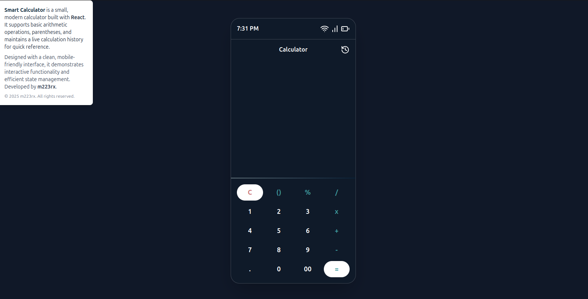
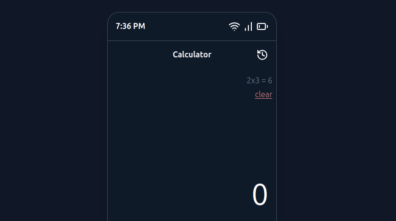
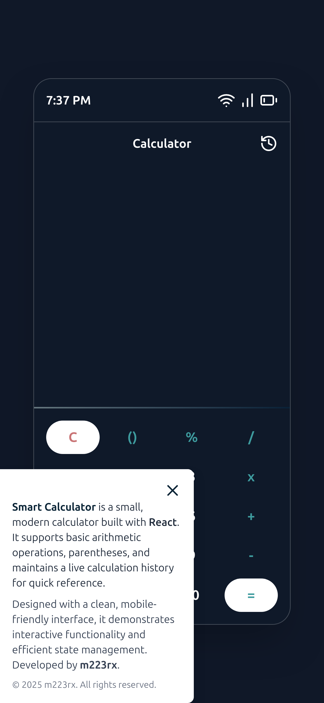

# 🌐 Smart Calculator by m223rx

---

## 🚀 Features

- **Basic Arithmetic Operations**  
  Supports addition, subtraction, multiplication, and division.

- **Parentheses Support**  
  Automatically balances open and close parentheses for complex expressions.

- **Live Calculation History**  
  Stores the last 5 calculations for quick reference.

- **Mobile-Friendly Interface**  
  Clean, responsive design suitable for mobile and desktop screens.

- **Interactive UI**  
  Modern glass-like backgrounds, blur effects, and smooth button interactions.

- **Error Handling**  
  Detects invalid expressions and displays "Error" without crashing.

---

## 🛠 Tech Stack

- **Frontend:**

  - [React.js](https://reactjs.org/) – fast, component-based UI library
  - [Vite](https://vitejs.dev/) – development server and build tool
  - [Tailwind CSS](https://tailwindcss.com/) – utility-first styling
  - [Math.js](https://mathjs.org/) – safe evaluation of mathematical expressions
  - [Lucide-React](https://lucide.dev/) – icons for UI elements

- **State Management & Hooks:**

  - `useState` – managing input, result, and history
  - `useEffect` – updating timestamps and reactive UI

---

## 📸 Screenshots

### Main Calculator View

### History Panel

### Mobile View

---

## ⚡ Usage

1. **Clone the repository:**
git clone https://github.com/m223rx/smart-calculator.git
cd smart-calculator/frontend

2. **Install dependencies:**
   npm install

3. **Run the development server:**
   npm run dev

4. **Open http://localhost:5173**

## 🎨 Customization

Update TailwindCSS variables to change colors and theme.
Adjust the handleResult function to modify precision or rounding logic.
Add more advanced math functions by extending Math.js integration.

## 📂 Project Structure

src/
├── components/
│   ├── phone.jsx
│   └── navbar.jsx
├── assets/
│   └── screenshots/
├── App.jsx
├── main.jsx
├── App.jsx
└── index.css

## 💡 Future Enhancements

Add scientific calculator functionality (sin, cos, log, etc.)
Enable dark/light themes toggle
Support keyboard input in addition to on-screen buttons
Animate button presses and results for a smoother UX

## 👨‍💻 Developer
m223rx – 2025
© 2025 m223rx. All rights reserved.

---
